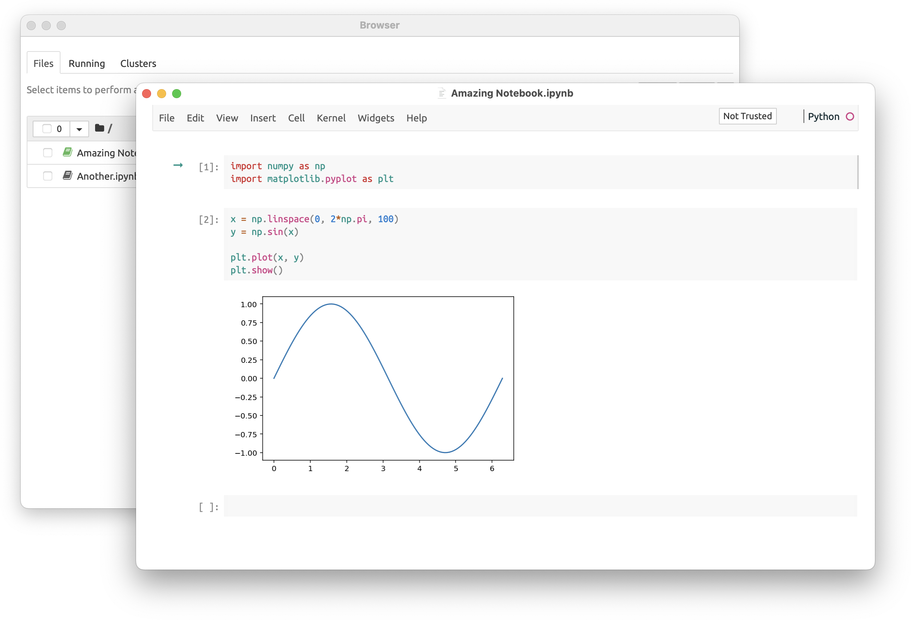

# Jupyter App for macOS
An app that launches and displays jupyter notebooks

### Quick introduction

After 2 years of not using [my previous app](https://github.com/python-mac/jupyterlab-app), I decided it was finally time to adapt it to current reality (which is, switching it from JupyterLab to Jupyter Notebooks, because I use them now).

It presented quite a challenge, since this time I had to learn how to deal with `NSDocument`s (and newly added `FileDocument` and `DocumentGroup`, which do not work in my case).

Please keep in mind that I'm not a Mac developer and I'm not really familiar with Swift, SwiftUI and Cocoa. If some decisions seems to be stupid, they probably are.

### How to use

First, download the app from [`Releases`](https://github.com/python-mac/jupyter-app/releases) and move it to `/Applications` folder.

The app should handle `ipynb` files, so you can set it to open them by default.

Behind the scenes, the app launches the `jupyter` process and automatically stops it after the app is about to close. So, obviously, `jupyter` needs to be installed and be in `$PATH`.

If you have any problems, you should probably modify shell scripts that [launch `jupyter`](Jupyter/launch-jupyter.sh) and [find root directory](Jupyter/get-root-dir.sh).

### External links
- [Jupyter website](https://jupyter.org)
- [This theme](https://github.com/neilpanchal/spinzero-jupyter-theme) is used on a screenshot (with Ubuntu fonts)
